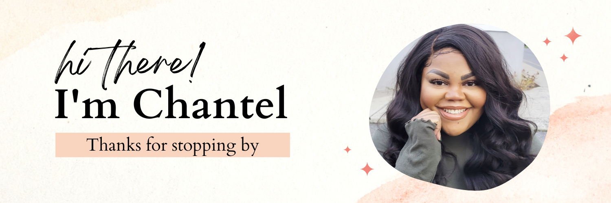

### 📫 How to reach me: ChantelPhillips@gmail.com

I'm a software / support enthusiast who loves to be a part of a community of great people. I have been a technology professional for the past 10 years in the hardware, software, networking, and A/V sectors. While at Key Digital, I was exposed to optimizing software and hardware work together for optimal performance. I was involved in firmware corrections and saw firsthand how essential software was. That excites me; I love finding inefficiencies and building great solutions.

One of my goals is to inspire diversity and inclusiveness in the software community. It's an excellent opportunity for everyone involved when different voices can be heard.

I built a website for my baking business and fell in love! That led to completing a bootcamp for full-stack web development at NuCamp. I started by learning HTML, CSS, and JavaScript. I then moved on to modern web development such as React, React Native, Node.JS, Docker, Express, MongoDB. My 6th-grade teacher Ms. Linton always called me her "little engineer" because of my love of math and science. Now I've found a way to use those passions.

- 🌱 I’m currently learning Typescript
- 👯 I’m looking to collaborate on fun OOP project build
- 💬 Ask me about anything pastry and sweets
- 😄 Pronouns: she/her
- ⚡ Fun fact: I adopted a senior Yorkie 4 years ago and I am an identical twin.

<!--
**Chaphi90/chaphi90** is a ✨ _special_ ✨ repository because its `README.md` (this file) appears on your GitHub profile.

Here are some ideas to get you started:

- 🔭 I’m currently working on ...
- 🌱 I’m currently learning ...
- 👯 I’m looking to collaborate on ...
- 🤔 I’m looking for help with ...
- 💬 Ask me about ...
- 📫 How to reach me: ...
- 😄 Pronouns: ...
- ⚡ Fun fact: ...
-->
